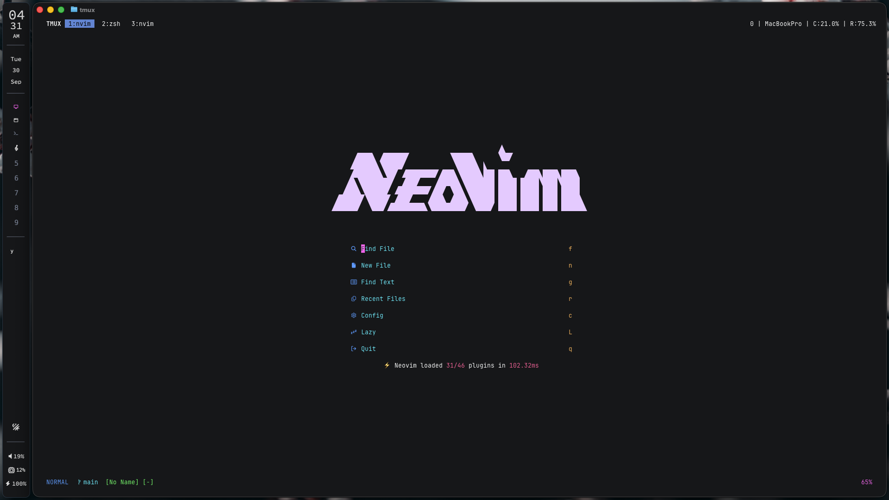

# SketchyBar Configuration

My config for [SketchyBar](https://felixkratz.github.io/SketchyBar/setup), a highly customizable menu bar for macOS



## About

This config for SketchyBar includes:

- A clock with hours, minutes, and AM/PM indicators
- Calendar
- Aerospace workspace labels with custom icons
  - Requires [Aerospace](https://github.com/iyioon/aerospace) to be installed.
- Front app indicator with scrollable label.
- Icons for
  - Themes (light/dark)
  - Volume indicator (click to open Sound preferences
  - CPU usage indicator (click to open Activity Monitor)
  - Battery indicator (click to open Battery preferences)

## Installation

```bash
brew tap FelixKratz/formulae
brew install sketchybar
```

Also make sure to have dependencies installed:

```bash
brew install --cask font-hack-nerd-font
brew install --cask font-source-code-pro
```

Copy over the config file:

```bash
git clone https://github.com/iyioon/sketchybar.git "${XDG_CONFIG_HOME:-$HOME/.config}"/sketchybar
```

Run the bar automatically at startup:

```bash
brew services start sketchybar
```

Make sure to go to System Preferences > Menu Bar, then set "Automatically hide and show the menu bar" to Always.

## Plugins

When you use/create additional plugins, make sure that they are made executable via

```bash
chmod +x name/of/plugin.sh
```

## Customization

Refer to this [discussion](https://github.com/FelixKratz/SketchyBar/discussions/47?sort=top) for more examples.
